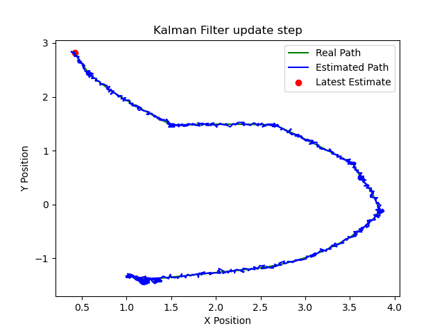
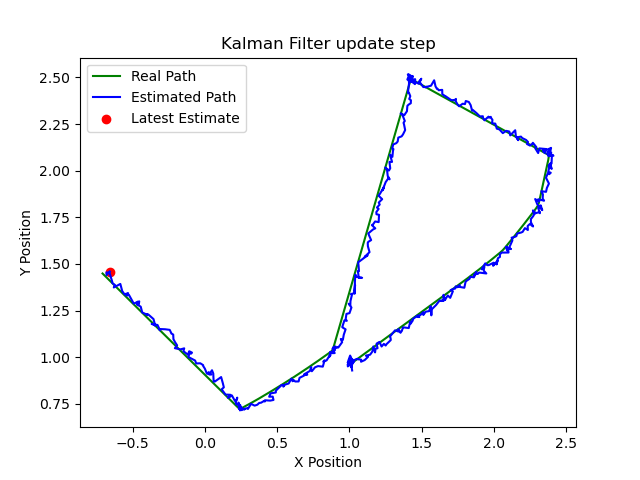
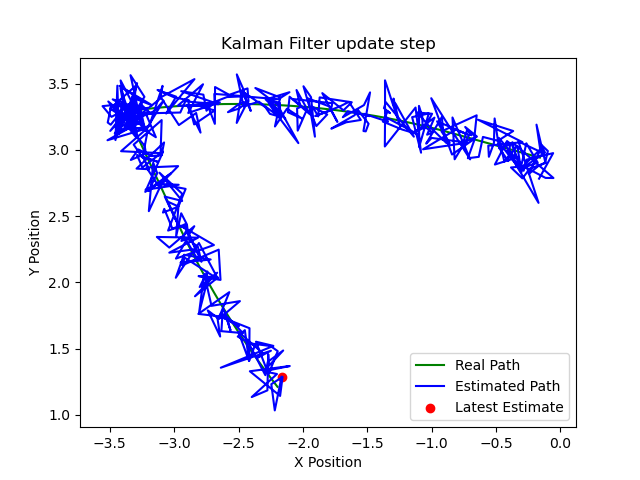
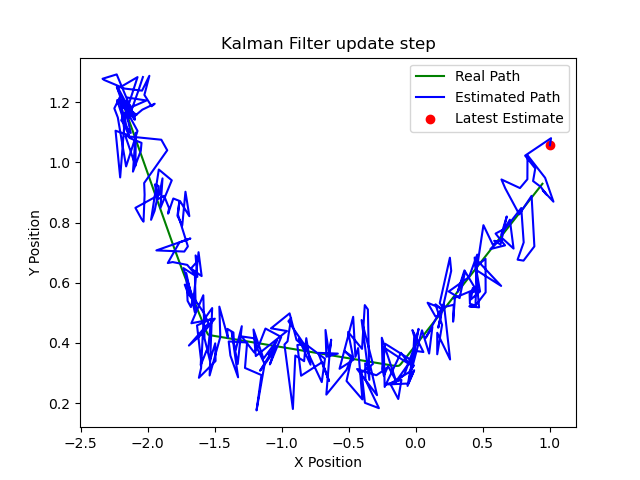
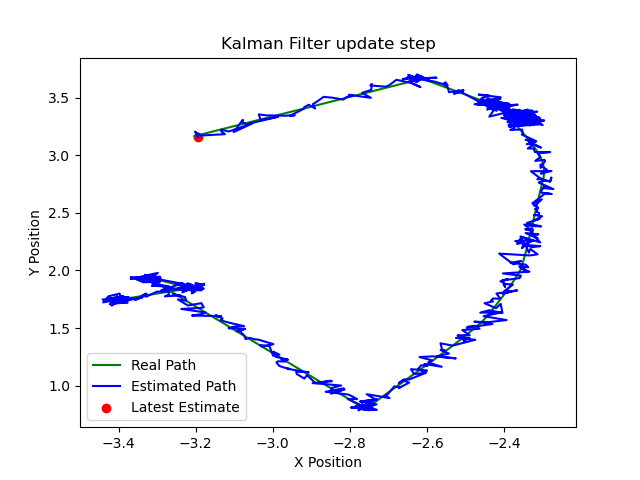

# Práctica 2 - Filtro de Kalman

## Objetivos

- Comprender e implementar un filtro de Kalman básico para estimar la posición del robot.
- Ampliar el modelo de estado para incluir la velocidad lineal y angular.
- Estudiar el comportamiento del filtro bajo diferentes configuraciones de ruido (proceso y medida).
- Preparar la base para la implementación de un Filtro de Kalman Extendido (EKF) en futuras prácticas.

---

## Estructura del proyecto

El código se organiza en los siguientes archivos:

- `kalman_filter.py`: contiene las clases `KalmanFilter` y `KalmanFilter_2`.
- `motion_models.py`: define el modelo de movimiento lineal.
- `observation_models.py`: define el modelo de observación.
- `kf_estimation.py`: nodo principal de ROS 2 que ejecuta el filtro.
- `sensor_utils.py`: funciones auxiliares para extracción y normalización de datos.
- `visualization.py`: gestiona la visualización de estimaciones.

---

## Implementación

### Modelo 1 – Filtro de Kalman básico (`KalmanFilter`)

- Modelo de estado: posición en 2D `(x, y, θ)`.
- Observación: posición medida con ruido.
- Control: velocidad lineal y angular.
- Implementado un modelo de movimiento lineal y una observación directa de la posición.

### Modelo 2 – Filtro de Kalman extendido (`KalmanFilter_2`)

- Modelo de estado extendido: `(x, y, θ, vx, vy, ω)`.
- Observación: posición y velocidades con ruido.
- Control: velocidad lineal en x, y y rotacional.
- Permite incorporar mejor la dinámica del movimiento real del robot.

---

## Resultados

Se realizaron experimentos con las tres configuraciones de ruido, generando las gráficas correspondientes que se adjuntan como evidencia.

### 🔵 Caso 1 – Ruido bajo (por defecto)
Se realizaron las gráficas con valores bajos para la matriz inicial de covarianza (Q) y el ruido añadido a la medida (R)
|  |   |
   
- El filtro sigue con precisión la trayectoria del robot.
- Estimación muy cercana a la trayectoria real.
- El modelo confía tanto en el proceso como en la medición.

### 🔴 Caso 2 – Ruido alto en la medida
Se realizaron las gráficas con valores bajos para la matriz inicial de covarianza (Q). Para el ruido añadido a la medida (R), se multiplicó por 5 quedando: 
`noise_std = np.array([0.02, 0.02, 0.01, 0.02, 0.02, 0.01])*5`
|  |  |
    

    

- El filtro tiene un error importante ya que las mediciones no son nada exactas.
- La trayectoria estimada es muy errática.
- Se observa una buena compensación gracias al modelo del movimiento.

### 🟠 Caso 3 – Ruido alto en el proceso
Se realizaron las gráficas con valores bajos para el ruido añadido a la medida (R). Para  la matriz inicial de covarianza (Q), se multiplicó por 100 quedando: 
` initial_covariance = np.eye(3) * 100 `
| |  |
    

   

- El filtro reacciona de forma menos brusca al ruido.
- En el caso del Filtro de Kalman puro, se genera un pequeño offset que separa la trayectoria estimada de la real.
- Esto demuestra cómo `Q` (ruido del proceso) afecta directamente la confianza en el modelo dinámico.

---

## Análisis

- Ajustar la matriz `Q` (ruido del proceso) permite controlar cuánto confía el filtro en su predicción vs la medida.
- Un valor alto en `Q` implica más incertidumbre en el modelo, lo cual puede ser útil si el robot realiza movimientos impredecibles.
- Ajustar la matriz `R` (ruido de la medida) permite mitigar medidas muy ruidosas.
- El modelo extendido con velocidad permite una estimación más rica y realista, aunque también es más sensible a errores en la observación de la velocidad.

---

## Conclusión

Esta práctica permite entender cómo funciona internamente un filtro de Kalman, cómo se implementa en ROS 2, y cómo se comporta frente a distintas fuentes de ruido. El modelo ampliado servirá como base para la próxima práctica centrada en el Filtro de Kalman Extendido (EKF), necesario para tratar con sistemas no lineales.
